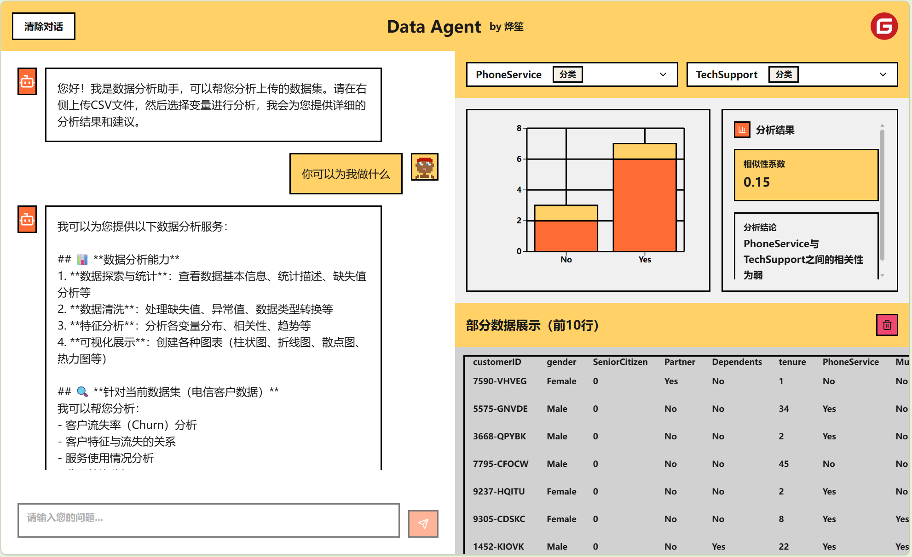
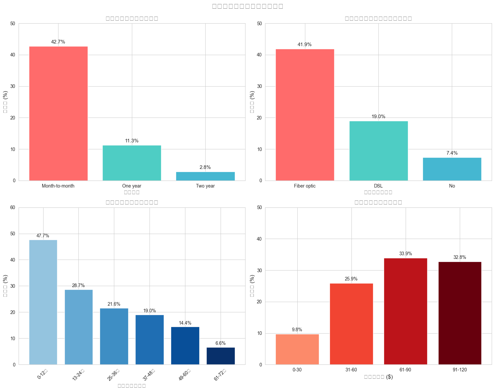

# Data Agent - AI 数据分析助手

一个基于 LangChain 1.1 和 React 的 Agentic RAG + 数据分析应用，支持私有知识库问答、工具调用、多轮记忆与流式响应。

> 面试准备建议：请先阅读 `INTERVIEW_GUIDE.md`，再结合代码逐模块演示。



## 主要功能

### 企业知识库 RAG

- **私有知识库构建**：支持从 `backend/knowledge_base/docs` 加载文档并重建向量索引
- **双向量后端**：支持 JSON 本地索引与 Chroma 向量数据库两种后端，通过 `KB_VECTOR_BACKEND` 切换
- **混合检索策略**：向量相似度 + 关键词匹配融合，提升召回稳定性
- **混合重排（Rerank）**：检索初筛后支持多信号融合重排或可选 Cross-Encoder 精排，进一步提升 top-k 质量
- **工具化检索**：Agent 通过 `retrieve_knowledge` 工具检索并带来源编号回答
- **离线评测**：内置 20 题评测集与评测脚本，输出 Hit@K / Keyword Recall / MRR 指标
- **状态可观测**：支持 `GET /kb/stats` 查看文档数、切片数、Embedding 配置

### 对话与 Agent 编排

- **Tool Calling**：统一调度知识检索、外部搜索、Python计算、图表生成工具
- **MCP 工具源接入**：支持通过 Model Context Protocol 动态加载外部工具，并与本地工具混合编排
- **多轮上下文记忆**：后端基于 `session_id` 维护会话历史并做窗口裁剪
- **SSE 流式返回**：`/chat/stream` 输出 `meta/chunk/done` 事件，前端边收边展示
- **异常回退机制**：主模型失败时自动回退到“检索优先”回答，保证可用性

### 数据管理

- **CSV 文件上传**：支持点击或拖拽上传 CSV 文件
- **数据预览**：自动显示数据前 10 行，支持列类型识别
- **智能预处理**：自动清理空行空列、类型推断、缺失值填充
- **数据持久化**：页面刷新后数据自动恢复

### AI 数据分析

- **流式对话**：基于 Server-Sent Events (SSE) 的实时流式响应
- **Python 代码执行**：Agent 可执行 Pandas 数据分析代码
- **图表生成**：支持使用 Matplotlib/Seaborn 生成可视化图表
- **动态上下文**：根据当前数据集自动更新 Agent 的 System Prompt

### 数据可视化

- **智能图表**：根据变量类型自动生成合适的图表
  - 离散 + 离散 → 堆叠柱状图
  - 连续 + 连续 → 散点图
  - 混合类型 → 分组柱状图
- **相关性分析**：点击变量快速计算相关系数
- **图表展示**：Agent 生成的图表自动显示在可视化面板



## 项目结构

```
Data Agent/
├── backend/                 # 后端服务
│   ├── src/
│   │   ├── agent.py        # LangGraph Agent 定义
│   │   ├── config.py       # 统一配置读取（聊天模型 / Embedding / API Key）
│   │   ├── server.py       # FastAPI 服务器
│   │   ├── data_manager.py # 数据管理模块
│   │   ├── llm_factory.py  # 聊天模型工厂（Ollama / DashScope-Qwen）
│   │   ├── tools.py        # Agent 工具（Python执行、绘图）
│   │   ├── rag_engine.py   # RAG 引擎（混合检索 + Chroma + Rerank）
│   │   ├── reranker.py     # 重排器（多信号融合 / Cross-Encoder）
│   │   ├── mcp_tools.py    # MCP 工具源接入
│   │   └── state.py        # Agent 状态定义
│   ├── eval/               # RAG 检索质量评测
│   │   ├── eval_dataset.json  # 20 题评测集
│   │   └── run_eval.py     # 评测脚本（Hit@K / MRR / KW Recall）
│   ├── knowledge_base/     # 知识库（文档 + 索引）
│   │   ├── docs/           # 企业知识库文档
│   │   └── chroma_db/      # Chroma 持久化目录
│   ├── static/             # 静态文件（生成的图片）
│   ├── temp_data/          # 临时上传的数据文件
│   └── pyproject.toml      # Python 依赖配置
│
├── frontend/               # 前端应用
│   ├── src/
│   │   ├── components/     # React 组件
│   │   │   ├── Header.tsx           # 顶部导航栏
│   │   │   ├── ChatInterface.tsx    # AI 对话界面
│   │   │   ├── DataUpload.tsx       # 数据上传组件
│   │   │   ├── VisualizationPanel.tsx # 可视化面板
│   │   │   └── ui/                  # UI 组件库
│   │   ├── config/
│   │   │   └── api.ts      # API 配置
│   │   └── App.tsx         # 主应用组件
│   ├── public/             # 静态资源
│   └── package.json        # Node.js 依赖配置
│
└── README.md              # 项目说明文档
```

## 快速开始

### 前置要求

- Python 3.10+
- Node.js 18+
- 本地 Ollama 服务（默认 `http://localhost:11434`）
- 推荐模型：
  - 对话模型：`qwen3.5:0.8b`（可替换）
  - 向量模型：`nomic-embed-text`

### 安装步骤

#### 1. 配置后端

```bash
cd backend

# 安装依赖（需要先安装 uv，参考 https://uv.fan/w/installation）
uv sync

# 复制模板并填写配置
# Windows PowerShell: Copy-Item .env.example .env
# 然后在 .env 中设置聊天模型、Embedding 模型、API Key 等
```

#### 2. 配置前端

```bash
cd frontend

# 安装依赖
npm install
```

### 启动服务

#### 启动后端

```bash
cd backend
uv run python -m src.server
```

后端服务将在 `http://localhost:8002` 启动。

#### 启动前端

```bash
cd frontend
npm run dev
```

前端应用将在 `http://localhost:5173` 启动（Vite 默认端口）。

### 访问应用

打开浏览器访问 `http://localhost:5173`，即可开始使用。

### 构建私有知识库（新增）

1. 将你的文档放入 `backend/knowledge_base/docs/`
2. 调用 `POST http://localhost:8002/kb/rebuild`
3. 通过 `GET http://localhost:8002/kb/stats` 检查索引状态
4. 在前端对话区提问知识库问题（例如“P0故障响应时效是什么？”）

## 配置说明

### 后端配置

**环境变量**（`.env` 文件）：

```env
CHAT_MODEL_PROVIDER=ollama
CHAT_MODEL_NAME=qwen3.5:2b
CHAT_TEMPERATURE=0
CHAT_MAX_TOKENS=

OLLAMA_BASE_URL=http://localhost:11434
OLLAMA_NUM_CTX=4096
OLLAMA_NUM_GPU=1
OLLAMA_NUM_THREAD=4
OLLAMA_LOW_VRAM=true

EMBEDDING_PROVIDER=ollama
EMBEDDING_MODEL_NAME=nomic-embed-text

DASHSCOPE_API_KEY=
DASHSCOPE_BASE_URL=https://dashscope.aliyuncs.com/compatible-mode/v1

MAX_SESSION_MESSAGES=16
STREAM_CHUNK_SIZE=24
STREAM_CHUNK_DELAY=0.01
SESSION_MEMORY_BACKEND=redis
REDIS_URL=redis://127.0.0.1:6379/0
REDIS_USERNAME=
REDIS_PASSWORD=
REDIS_SESSION_PREFIX=dataagent:chat:session:
REDIS_SESSION_TTL_SECONDS=86400

# MCP tool source (可选)
MCP_ENABLED=false
MCP_TOOL_MODE=append
MCP_SERVER_NAME=primary
MCP_SERVER_TRANSPORT=streamable_http
MCP_SERVER_URL=
MCP_SERVER_COMMAND=
MCP_SERVER_ARGS=[]
MCP_TOOL_ALLOWLIST=
```

聊天模型与 Embedding 模型已解耦：

- 聊天模型使用 `CHAT_MODEL_PROVIDER` + `CHAT_MODEL_NAME`
- Embedding 使用 `EMBEDDING_PROVIDER` + `EMBEDDING_MODEL_NAME`
- 当前默认聊天模型是本地 Ollama `qwen3.5:2b`
- 当前默认 Embedding 模型是 `nomic-embed-text`

切换到云端 Qwen（DashScope）示例：

```env
CHAT_MODEL_PROVIDER=dashscope
CHAT_MODEL_NAME=qwen-plus
DASHSCOPE_API_KEY=你的阿里云百炼 Key
```

如果你想查看后端当前实际生效的聊天模型与 Embedding 配置，可以访问：

```text
GET http://localhost:8002/models/current
```

Redis 记忆说明：

- 默认优先使用 Redis 保存会话记忆（按 `session_id` 存储），支持重启后保留最近对话窗口。
- 如果你的 Redis 开启了认证，可以额外配置 `REDIS_USERNAME` 与 `REDIS_PASSWORD`；也可以直接把密码写进 `REDIS_URL`。
- 当 Redis 不可用时，会自动回退到内存模式，不影响基础对话功能，但服务重启后历史会丢失。
- 如需强制仅使用内存模式，可设置 `SESSION_MEMORY_BACKEND=memory`。

MCP 工具源说明：

- 设置 `MCP_ENABLED=true` 后，Agent 会尝试连接 MCP Server 并加载工具。
- `MCP_TOOL_MODE=append` 时，MCP 工具会追加到本地工具；`replace` 时只使用 MCP 工具。
- 传输方式支持 `streamable_http`、`sse`、`stdio`。
- MCP 连接失败时会自动回退到本地工具，不影响现有问答链路。

**API 端口**：默认 `8002`，可在 `server.py` 中修改

**数据存储**：

- 上传的文件保存在 `backend/temp_data/`
- 生成的图片保存在 `backend/static/images/`

### 前端配置

**API 地址**：在 `frontend/src/config/api.ts` 中配置后端地址

```typescript
export const API_BASE_URL = 'http://localhost:8002';
```

## 使用指南

### 1. 上传数据

- 点击右侧面板的"上传数据"区域，或直接拖拽 CSV 文件
- 上传成功后，数据预览会自动显示在前 10 行
- 系统会自动识别变量类型（离散/连续）

### 2. 分析数据

#### 方式一：可视化分析

- 在数据预览区域点击两个变量
- 系统自动计算相关性并生成合适的图表

#### 方式二：AI 对话分析

- 在左侧对话界面输入问题，例如：
  - "分析一下数据的整体情况"
  - "计算各列的平均值"
  - "绘制年龄和收入的散点图"
- Agent 会执行 Python 代码并返回结果
- 如果生成了图表，会自动显示在可视化面板

### 3. 查看结果

- **对话结果**：在左侧对话界面查看 AI 的分析结果
- **可视化图表**：在右上角可视化面板查看图表
- **生成图片**：Agent 生成的图片会显示在可视化面板
